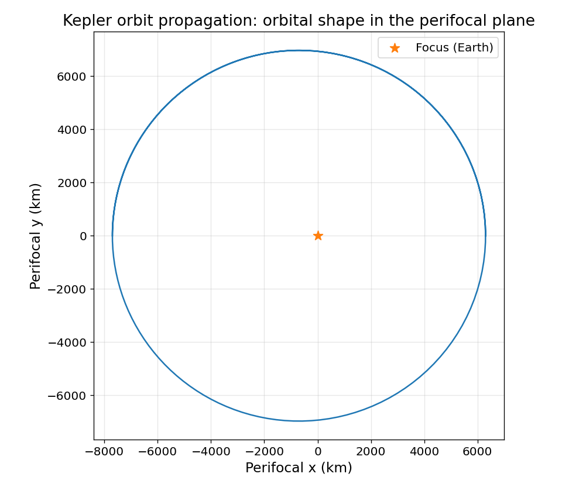
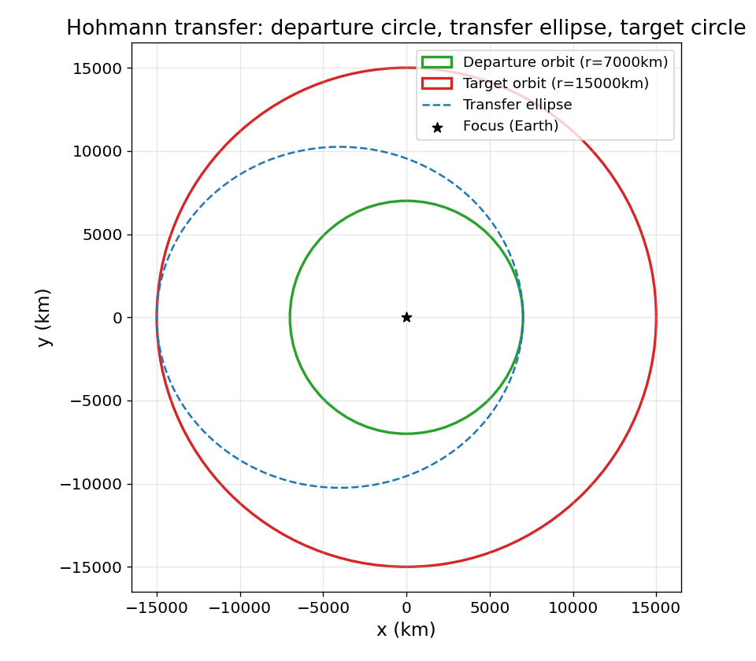
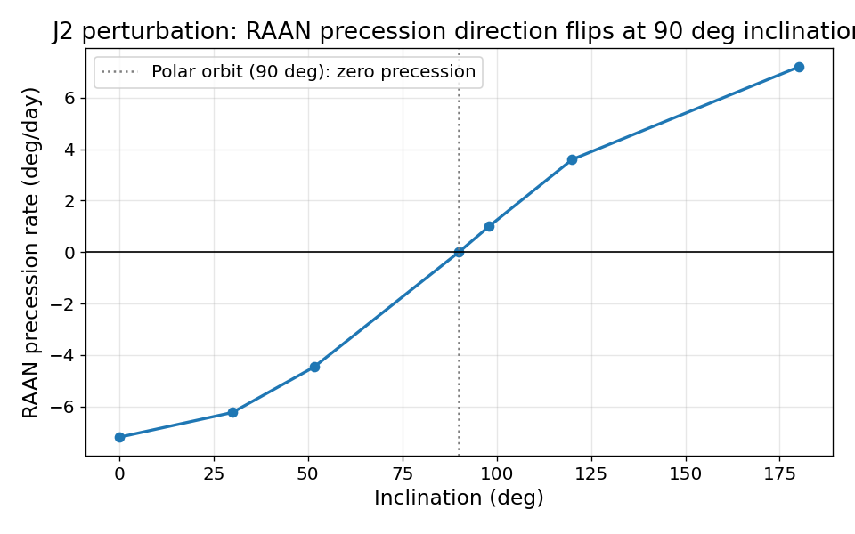
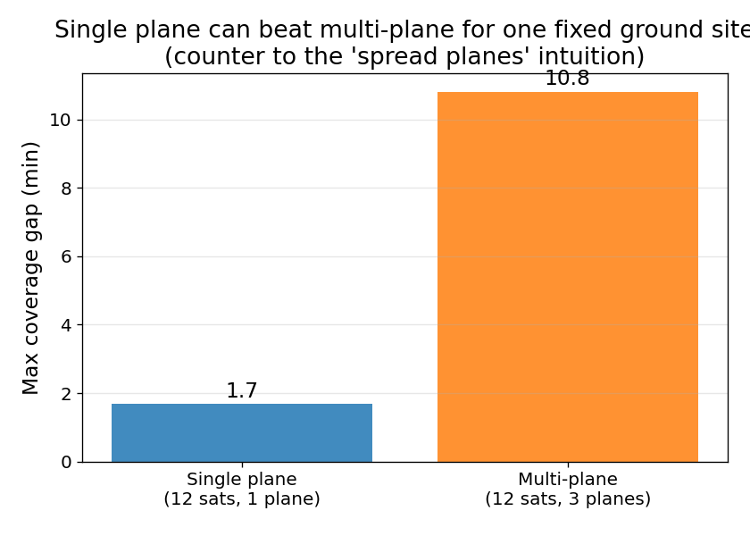
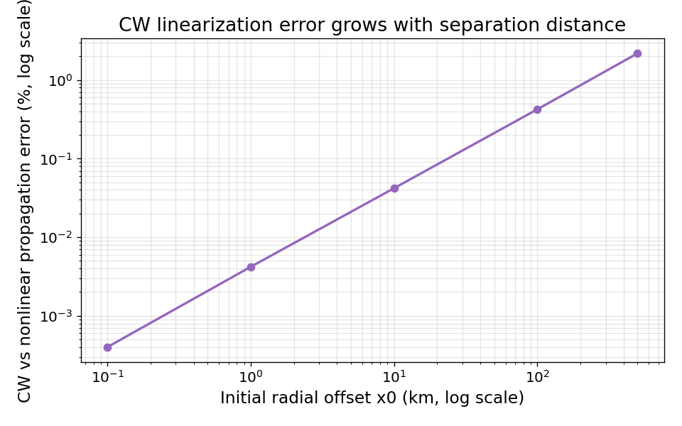
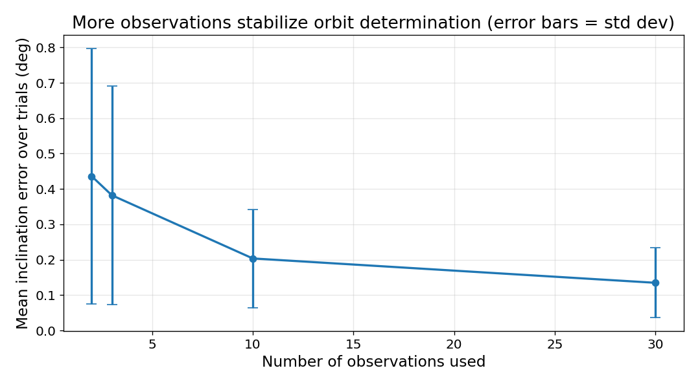

# 궤도역학 실험실

궤도역학(Orbital Mechanics) 자체를 1급 시뮬레이션 대상으로 삼아 처음부터 직접 구현하는 프로젝트입니다. 케플러 방정식과 궤도 전파(01), 궤도요소-상태벡터 변환과 보존량 검증(02), 2체 문제 수치적분(RK4, 03), 좌표계 변환(ECI/ECEF/SEZ, 04), 실측 궤도 전파 기반 지상국 가시성(05), 호만 전이(06), J2 섭동에 의한 궤도면 세차(07)까지 다루고, 08번은 새 시뮬레이션 없이 앞선 결과 CSV를 그래프로 시각화합니다. 09번은 두 위치·비행시간에서 궤도 속도를 구하는 란베르트 문제, 10번은 다중 위성 성좌의 지상 커버리지 공백, 11번은 위성간 링크(ISL)의 지구 차단 여부를 순수 기하로 판정합니다. 12번은 지구 중심 궤도를 벗어나 Patched Conic 근사로 지구-화성 행성간 임무의 델타-V를 계산합니다. 13번은 Clohessy-Wiltshire(Hill) 방정식으로 목표 위성 근접 도킹/랑데부의 상대운동을 닫힌 해로 구합니다. 14번은 그 반대 방향 — 노이즈 낀 레이더 관측값(거리·방위각·고도각)"만"으로 원궤도 요소를 역산하는 궤도 결정(Orbit Determination)입니다. 15번은 06번과 정반대 축의 임무 설계 — 순간 임펄스 대신 이온엔진 같은 저추력 전기추진으로 연속 접선 추력을 가해 원궤도를 서서히 나선형으로 올리는 전이입니다. 16번은 이 프로젝트 최초로 궤도(병진운동)가 아닌 위성 자체의 회전(자세동역학)을 다룹니다 — 토크 없는 강체의 오일러 회전방정식을 수치적분해, 관성모멘트가 가장 크거나 작은 축 주위 회전은 안정적이지만 중간 크기 축 주위 회전은 작은 섭동에도 발산한다는 중간축 정리(테니스 라켓 정리)를 재현합니다. 17번은 07번(J2 섭동)이 방치했던 RAAN 드리프트를 실제로 다룹니다 — 예측 세차율 자체가 아니라 그 예측에서 벗어나는 작은 잔여 오차를 주기적인 평면 변경 기동으로 보정하는 궤도 유지(station-keeping) 비용을 계산합니다. 18번은 15번(저추력 전이)과 정확히 거울상입니다 — 접선방향 연속 추력 대신 속도 반대방향으로 작용하는 미세한 대기항력이 저궤도 위성의 에너지를 서서히 빼앗아, 원궤도가 나선형으로 하강하다 결국 재진입하는 과정(궤도 재진입/대기항력 감쇠)을 지수함수 대기밀도 모델로 계산합니다. 19번은 12번(Patched Conic)이 명시적으로 피했던 진짜 3체 문제를 원형 제한 3체 문제(CR3BP)로 정면으로 엽니다 — 지구-달처럼 두 개의 큰 천체가 만드는 회전 중력장 안에서, 질량이 무시할 만한 세 번째 물체가 정지해 있을 수 있는 5개의 평형점(라그랑주점)을 찾고, 그중 L4/L5는 안정, L1/L2/L3는 불안정하다는 것을 선형화 고유값과 직접 수치적분 양쪽으로 확인합니다.

## 데이터링크 계층 실험실과의 관계

이 프로젝트는 [데이터 링크](../데이터%20링크/) 자습 프로젝트의 형제 프로젝트입니다. 데이터 링크 프로젝트는 네트워킹 프로토콜 시뮬레이터가 본체이고, 심우주 통신·궤도 접촉 창·링크 예산 같은 항공우주 관련 스크립트(16, 26, 27번)는 통신을 위한 응용 사례로 궤도역학을 사각파 근사나 임의의 상수로 단순화했습니다. 이 프로젝트는 그 순서를 뒤집습니다 — 궤도역학 자체가 본체이고, 통신(지상국 가시성)은 그로부터 파생되는 응용입니다. 예를 들어 05번은 데이터 링크 프로젝트의 26번이 "사각파 접촉 창 근사"로 때웠던 부분을, 01번의 실제 케플러 궤도 전파와 04번의 좌표변환으로 실측 계산합니다.

두 프로젝트는 완전히 독립된 별도 git 저장소이며, 코드나 의존성을 공유하지 않습니다. 이 프로젝트에서만 `numpy`가 새로 필요합니다(벡터/행렬 연산 때문).

프로젝트 전체 요약은 **[thank0906411-ship-it.github.io/orbital-mechanics-lab](https://thank0906411-ship-it.github.io/orbital-mechanics-lab/)** 에서 그래프와 함께 바로 볼 수 있습니다(저장소의 [report.html](report.html) 파일 링크를 클릭하면 렌더링된 페이지가 아니라 GitHub의 소스 코드 뷰어로 열리니, 실제 페이지를 보려면 반드시 위 GitHub Pages 주소로 접속하세요). `run_all.sh`/`run_all.ps1` 실행 시 `results/*.csv`를 바탕으로 `report.html`이 자동 재생성되며, 같은 내용이 GitHub Pages가 서빙하는 `index.html`로도 동기화됩니다.

## 주요 결과

`results/*.png`는 실행할 때마다 새로 생성되는 산출물이라 `.gitignore`에 포함되어
저장소에는 커밋되지 않습니다. 아래 6장은 대표 그래프를 `docs/images/`에 별도로
복사해 저장소에 함께 커밋해 둔 것으로, 전체 그래프는 위 GitHub Pages 링크
([thank0906411-ship-it.github.io/orbital-mechanics-lab](https://thank0906411-ship-it.github.io/orbital-mechanics-lab/))
에서 볼 수 있습니다.

<table>
<tr>
<td width="33%"><br><sub>케플러 궤도 전파: 궤도면 위 타원 궤적</sub></td>
<td width="33%"><br><sub>호만 전이: 출발궤도-전이타원-목표궤도</sub></td>
<td width="33%"><br><sub>J2 섭동: 경사각에 따른 RAAN 세차율 부호 반전</sub></td>
</tr>
<tr>
<td width="33%"><br><sub>성좌 커버리지: 단일 평면이 다중 평면을 앞서는 반직관적 결과</sub></td>
<td width="33%"><br><sub>CW 랑데부: 초기 옵셋이 커질수록 커지는 선형화 오차</sub></td>
<td width="33%"><br><sub>궤도 결정: 관측 개수가 늘수록 줄어드는 평균 오차/표준편차</sub></td>
</tr>
</table>

## 구성

스크립트는 다루는 물리 개념별로 하위 폴더에 묶여 있습니다. 각 폴더가 이미 분류
역할을 하므로 파일명에는 더 이상 전역 번호(01〜14)를 붙이지 않고, 내용을 그대로
드러내는 이름을 씁니다. 실행 순서와 스크립트 간 의존 관계(뒤 단계가 앞 단계의
함수를 재사용하는 관계)는 아래 표와 "프로젝트 확장 방향" 절의 서술로 설명합니다
— 결과 그래프 파일명(`results/01_kepler_orbit_shape.png` 등)에는 참고용으로 이
번호가 여전히 접두사로 남아 있습니다.

| 스크립트 | 주제 |
|---|---|
| `propagation/kepler_orbit_propagation.py` | 케플러 방정식(M=E-e·sinE)을 뉴턴-랍슨으로 풀어 궤도 위치를 시간의 함수로 전파. 이후 모든 스크립트가 이 모듈을 재사용 |
| `propagation/orbital_elements_and_energy.py` | 6개 궤도요소 ↔ 상태벡터(위치/속도) 변환, vis-viva 방정식, 비에너지/비각운동량 보존 검증 |
| `propagation/two_body_numerical_integration.py` | 2체 운동방정식을 RK4로 직접 수치적분, 01/02번 해석해와 대조하며 O(h⁴) 수렴 차수 검증 |
| `frames/coordinate_frame_transforms.py` | ECI ↔ ECEF, ECI → 지평좌표계(SEZ) 변환과 방위각/고도각 계산 |
| `missions/ground_station_visibility.py` | 01번 실제 궤도 전파 + 04번 좌표변환으로 지상국 접촉 창(AOS/LOS)을 실측 계산 — 사각파 근사가 아님 |
| `missions/hohmann_transfer.py` | 호만 전이(최소 에너지 궤도 변경)의 델타-V와 전이시간, LEO→GEO 교과서 값과 대조 |
| `perturbations/j2_perturbation.py` | 지구 편평도(J2)에 의한 RAAN/근점편각 세차, 임계경사각과 태양동기궤도 조건 확인 |
| `visualization/visualize_orbits.py` | 01, 04, 05, 06, 07, 09, 10, 11, 12, 13, 14, 15, 16, 17, 18, 19번의 CSV를 궤도 형상·고도각 시계열·접촉 창 간트차트·전이궤도·세차·란베르트 비교·성좌 커버리지·ISL 가시성·행성간 전이궤도·CW 상대운동·궤도 결정 오차·저추력 나선 궤적·자세동역학 안정성·궤도 유지 톱니파·재진입 하강 나선·라그랑주점 배치/안정성 궤적 그래프로 시각화 |
| `missions/lambert_problem.py` | 두 위치·비행시간으로 궤도 속도를 구하는 란베르트 문제(유니버설 변수·스텀프 함수), 06번 호만 전이와 교차검증 |
| `constellations/constellation_coverage.py` | 워커 델타(Walker Delta) 성좌 패턴 생성, 지상 지점의 커버리지 공백(revisit gap) 계산 |
| `constellations/intersatellite_link_visibility.py` | 위성간 링크(ISL)의 지구 차단 여부를 선분-구 최근접 거리 기하로 판정 |
| `missions/patched_conic_interplanetary.py` | Patched Conic(이어붙인 원뿔곡선) 근사로 지구→화성 임무의 델타-V·전이시간 계산, 06번 호만 전이 공식을 태양 GM으로 재사용 |
| `missions/clohessy_wiltshire_rendezvous.py` | Clohessy-Wiltshire(Hill) 방정식으로 목표 위성 근접 상대운동을 닫힌 해로 계산, 제로 드리프트 조건과 근사 유효 범위 검증 |
| `missions/orbit_determination.py` | 노이즈 낀 레이더 관측값(거리/방위각/고도각)에서 04번 정변환을 역산해 위치를 복원하고, SVD로 원궤도(반장축/경사각/RAAN)를 최소자승 피팅 |
| `missions/low_thrust_transfer.py` | 03번 RK4 적분기에 접선방향 연속 추력 가속도를 더해 원궤도가 나선형으로 상승하는 저추력 전이를 직접 적분, Edelbaum 근사·06번 호만 전이와 교차검증 |
| `attitude/torque_free_rigid_body.py` | 토크 없는 강체의 오일러 회전방정식을 RK4로 직접 적분, 회전 에너지/각운동량 보존을 검증하고 중간축 정렬 회전만 작은 섭동에도 발산함(중간축 정리)을 확인 — 궤도(병진운동)와 독립적인 새 물리 영역 |
| `missions/station_keeping.py` | 07번 예측 세차율의 잔여 오차를 평면 변경(plane-change) 델타-V(Δv=2·v·sin(각도/2), 새로 정의)로 주기 보정, RAAN 오차가 톱니파로 유계에 머물고 허용 오차와 무관하게 총 델타-V가 거의 일정함을 확인 |
| `missions/orbital_decay.py` | 15번의 거울상 — 03번 RK4 적분기에 속도 반대방향 대기항력 감속(지수함수 밀도 모델, 탄도계수 기반)을 더해 원궤도가 나선형으로 하강해 재진입하는 과정을 직접 적분, 재진입 근처에서 하강이 가속화되는 비선형 패턴과 탄도계수/초기고도에 따른 궤도 수명 민감도를 확인 |
| `missions/lagrange_points.py` | 12번이 피했던 진짜 3체 문제를 원형 제한 3체 문제(CR3BP)로 정면 돌파 — 회전좌표계 운동방정식(원심력·코리올리 힘)으로 콜린스 라그랑주점(L1/L2/L3, 이분법)과 삼각 라그랑주점(L4/L5, 닫힌 공식)을 찾고, 선형화 야코비 행렬 고유값과 RK4 직접 적분 양쪽으로 L4/L5 안정·L1/L2/L3 불안정을 확인 |
| `orbit_math.py` | 02/04/05/07/11/14번이 공유하는 3축 회전행렬(`rotation_matrix_x/y/z`)과 지구 반지름 상수 — 여러 하위 폴더가 공통으로 참조하므로 저장소 루트에 둠 |
| `generate_report.py` | `results/*.csv`와 `report_template.html`로 `report.html`을 재생성 — 전체를 오케스트레이션하므로 루트에 둠 |

## 요구 사항

- Python 3.11 이상
- `pip install -r requirements.txt` (numpy, matplotlib, pytest, pytest-cov, ruff)

## 실행 방법

### 전체 파이프라인 한 번에 실행

```bash
# Linux / macOS / WSL / Git Bash
./run_all.sh

# Windows PowerShell
.\run_all.ps1
```

pytest 전체 테스트 → 01〜07번 시뮬레이션(호만 전이 직후 15번 저추력 전이와 18번 궤도 재진입 포함, J2 섭동 직후 17번 궤도 유지 포함) → 09〜14번 시뮬레이션(란베르트 문제, 성좌 커버리지, ISL 가시선, 행성간 궤적)과 12번 직후 19번 라그랑주점 → 도킹/랑데부, 궤도 결정 → 16번 자세동역학 → 08번 결과 시각화 → `report.html` 재생성까지 총 21단계를 순서대로 실행합니다. 08번은 09〜19번의 CSV도 읽으므로 08번이 그 뒤에 실행됩니다(파일 번호와 실행 순서가 다른 이유). 결과 CSV와 그래프는 `results/`에 생성됩니다.

`generate_report.py`만 다시 실행하고 싶다면(예: `results/`는 그대로 두고 리포트 텍스트만 갱신할 때):

```bash
python generate_report.py
```

### 개별 스크립트 실행

모든 스크립트는 인자 없이 실행하면 기본값으로 재현 가능한 데모가 돌아갑니다.

```bash
python propagation/kepler_orbit_propagation.py
python missions/ground_station_visibility.py
python missions/hohmann_transfer.py --r1-km 6678 --r2-km 42164
python missions/low_thrust_transfer.py --thrust-accel-km-s2 1e-5
python constellations/constellation_coverage.py
python missions/patched_conic_interplanetary.py
python missions/clohessy_wiltshire_rendezvous.py --target-altitude-km 800
python missions/orbit_determination.py --angle-noise-deg 0.1 --range-noise-km 1.0
python attitude/torque_free_rigid_body.py --inertia-i1 1.0 --inertia-i2 2.0 --inertia-i3 3.0
python missions/station_keeping.py --raan-tolerance-deg 0.1 --mission-duration-years 5
python missions/orbital_decay.py --initial-altitude-km 200 --ballistic-coefficient 50
python missions/lagrange_points.py --mass-ratio 0.012150585
```

모든 스크립트는 저장소 루트에서 실행해야 합니다(각 스크립트가 다른 하위 폴더의
스크립트/`orbit_math.py`를 상대경로로 참조하기 때문).

각 스크립트는 `--help`로 사용 가능한 옵션을 확인할 수 있습니다.

## 테스트

```bash
python -m pytest tests/ -v
```

뉴턴-랍슨의 이차수렴과 원궤도(e=0) 즉시수렴, 케플러 제2법칙(면적속도 일정), 궤도요소-상태벡터 왕복 변환의 정확성, 2체 문제의 비에너지/비각운동량 보존, RK4 수치적분이 해석해와 일치하고 스텝을 절반으로 줄이면 오차가 O(h⁴)답게 줄어드는지, ECI/ECEF 왕복 변환의 직교성, 천정(고도각 90도)과 지평선 위/아래 특이 케이스, 실측 궤도 전파로 접촉 창이 실제로 발견되고 경계 조건(관찰 종료 시점까지 접촉 중인 경우)을 올바르게 처리하는지, 호만 전이의 델타-V가 교과서 값과 일치하고 전이궤도가 근지점/원지점에서 정확한 반지름을 갖는지, J2 섭동에 의한 RAAN 세차 방향이 순행/역행 궤도에서 부호가 바뀌고 극궤도에서 0이 되는지, 임계경사각(약 63.4도)에서 근점편각 세차율이 0이 되는지, 스텀프 함수가 z=0에서 연속인지와 란베르트 일반해가 호만 전이 특수해와 교차검증되는지, 워커 델타 성좌가 요청한 위성 수/평면 수대로 정확히 생성되는지와 커버리지 공백 탐지가 접촉 창 탐지와 대칭적으로 동작하는지, 위성간 링크 기하 판정 함수가 지구 정반대편(반드시 차단)과 같은 위치(선분 미정의) 경계 케이스를 올바르게 처리하는지, SOI 공식이 알려진 형태와 일치하고 06번 호만 전이 함수를 태양 GM으로 감싼 결과가 06번을 직접 호출한 것과 정확히 일치하며 지구→화성 임무 델타-V/전이시간이 알려진 범위(약 259일, 5〜6km/s) 안에 있는지, 그리고 CW 상태천이행렬이 알려진 특수해(z축 궤도 주기마다 초기값 복귀, 완전 분리)를 재현하고 제로 드리프트 조건이 실제로 선형 발산을 막으며 CW 근사 오차가 초기 옵셋 크기에 비례해 커지는지, 관측값↔ECI 위치 왕복 변환이 04번 정변환의 정확한 역함수인지, 작은 노이즈에서 원궤도 요소가 거의 정확히 복원되고 노이즈가 커질수록 오차가 커지며 관측 개수가 늘수록(여러 시행 평균의) 오차와 표준편차가 함께 줄어드는지, 접선 추력 가속도가 속도 방향의 단위벡터에 정확한 크기를 곱하는지, 나선 전이 후 반장축이 목표에 도달하고 이심률이 작게 유지되는지, Edelbaum 근사와 수치적분 델타-V가 일치하는지, 저추력이 호만 전이보다 훨씬 오래 걸리는지, 추력이 커지면 전이 시간이 줄어드는지, 구대칭 강체는 오일러 방정식의 우변이 항상 0인지(알려진 특수해), 토크 없는 자유회전에서 회전 에너지/각운동량이 보존되는지, 최소축/최대축 정렬 회전이 작은 섭동에 안정적인지, 중간축 정렬 회전이 같은 섭동에 크게 발산하는지(중간축 정리), 세 축을 비교하면 중간축의 섭동 성장 배율이 압도적으로 큰지, 평면 변경 델타-V 공식이 각도 0/180도의 알려진 경계 케이스와 일치하는지, 보정 없는 잔여 RAAN 드리프트가 선형인지, 주기적 보정이 RAAN 오차를 허용 범위 이내로 묶는지, 허용 오차가 좁을수록 기동이 잦아지는지, 임무 기간 총 델타-V가 허용 오차 선택과 거의 무관한지, 대기밀도 함수가 고도가 높을수록 단조 감소하고 기준 고도에서 기준 밀도와 정확히 일치하는지, 항력 감속이 항상 속도 반대방향이고 속도가 0이면 항력도 0인지, 낮은 고도일수록 항력이 더 강한지, 대기항력만으로 원궤도가 재진입 고도까지 실제로 하강하는지, 궤적 후반부의 고도 감소율이 전반부보다 뚜렷이 큰지(가속 하강), 탄도계수가 클수록 궤도 수명이 길어지는지, 초기 고도가 선형으로 늘어날 때 궤도 수명이 그보다 훨씬 빠르게(기하급수적으로) 늘어나는지, 항력이 극단적으로 약하면 최대 스텝 안에 재진입하지 못해 명시적 오류를 내는지, 질량비 0.5(두 주천체 질량이 같음)에서 콜린스 라그랑주점이 대칭인지, L1/L2/L3의 x좌표 순서가 물리적으로 타당한지, 삼각 라그랑주점이 두 주천체로부터 정확히 거리 1(정삼각형)을 유지하는지, L4와 L5가 x축에 대해 대칭인지, 라그랑주점 자체에서는 CR3BP 가속도가 거의 0인지(평형점 정의), 콜린스 라그랑주점이 모두 불안정한지, 지구-달 질량비에서 삼각 라그랑주점이 안정한지, 질량비가 루스 임계값을 넘으면 삼각 라그랑주점도 불안정해지는지, 같은 크기의 섭동을 준 궤적이 L4 근처에서는 유계, L1 근처에서는 훨씬 크게 발산하는지 등을 검증합니다.

### 커버리지 측정

```bash
python -m pytest tests/ --cov=. --cov-report=term-missing
```

`visualization/visualize_orbits.py`와 `generate_report.py`, 각 스크립트의 `main()`(CLI 진입점, 콘솔 출력용 데모 실행부)은 커버리지 집계에서 제외됩니다 — 핵심 물리 공식과 검증 로직이 측정 대상입니다.

## 코드 스타일

[ruff](https://docs.astral.sh/ruff/)로 린트합니다.

```bash
python -m ruff check .
```

## 설계 원칙: 궤도역학 라이브러리를 쓰지 않는 이유

astropy나 poliastro 같은 검증된 궤도역학 라이브러리를 쓰면 훨씬 적은 코드로 더 정밀한 결과를 얻을 수 있습니다. 이 프로젝트는 의도적으로 그런 라이브러리를 배제하고 `numpy`(벡터/행렬 연산)만 사용합니다 — 케플러 방정식의 뉴턴-랍슨 반복, 좌표계 회전행렬, J2 세차 공식을 직접 구현하고 그 결과가 알려진 물리 법칙(보존량) 및 표준 문헌값(LEO→GEO 델타-V 등)과 일치하는지 검증하는 과정 자체가 이 프로젝트의 목적이기 때문입니다.

## 프로젝트 확장 방향

이 프로젝트는 기하 → 시간 전파 → 좌표계 → 응용 → 섭동 순서로 확장되었습니다:

1. **기초** — 케플러 방정식(M=E-e·sinE)을 뉴턴-랍슨으로 풀어 시간과 궤도 위치를 잇는다. 이심률이 커질수록 반복 횟수가 늘어나는 것, 이심률이 1에 매우 가까울 때(e=0.999 이상) 수렴이 느려지는 수치적 한계를 정직하게 관찰한다 (`propagation/kepler_orbit_propagation.py`)
2. **3차원 확장** — 01번의 궤도면 2차원 위치를 3번의 회전(argp, i, RAAN)으로 3차원 ECI 상태벡터로 확장하고, vis-viva 방정식과 비에너지/비각운동량 보존을 궤도 전체에서 수치로 검증한다. 원궤도에서는 근점편각이, 적도궤도에서는 승교점(RAAN)이 정의되지 않는 특이 케이스도 감추지 않는다 (`propagation/orbital_elements_and_energy.py`)
3. **수치적 기준선** — 해석해 대신 운동방정식(d²r/dt²=-μr/|r|³)을 RK4로 직접 적분해 01/02번의 해석해와 대조한다. 스텝을 절반으로 줄이면 오차가 실제로 약 16배(O(h⁴)) 줄어드는지 확인하고, 스텝이 너무 크면 위치는 맞아 보여도 에너지가 서서히 새는 것을 관찰한다 — 07번 섭동 모델이 왜 순수 2체 문제의 신뢰성 기준선을 먼저 만들어야 했는지 보여준다 (`propagation/two_body_numerical_integration.py`)
4. **관측 기하** — 지구 자전(ECI→ECEF, z축 회전 하나)과 관측자 위경도를 반영해 궤도 위치를 방위각/고도각으로 바꾼다. 처음에는 흔히 인용되는 회전 부호(Ry(90-φ)·Rz(+θ))를 그대로 썼는데, 천정(머리 바로 위) 위성의 고도각이 90도로 나오지 않는 버그가 실제로 발생했다 — SEZ 기저벡터를 위경도로 직접 쓴 표준식과 대조해 올바른 부호(Ry(φ-90)·Rz(-θ))로 고쳤다. 이 프로젝트에서 실제로 겪은 부호 버그를 정직하게 기록한다 (`frames/coordinate_frame_transforms.py`)
5. **이 프로젝트의 핵심 차별점** — 데이터 링크 프로젝트의 26번이 "사각파 접촉 창 근사"로 때웠던 지상국 접촉 창을, 01번의 실제 궤도 전파와 04번의 좌표변환으로 매 순간 고도각을 계산해 실측으로 찾는다. 지상국 위도가 다르면 접촉 빈도가 달라지는데, "위도가 궤도 경사각에 가까울수록 유리하다"는 단순한 직관과 달리 실제로는 지구 자전에 의한 경도 정렬까지 얽혀 훨씬 복잡한 패턴이 나온다는 것을 감추지 않고 보여준다 (`missions/ground_station_visibility.py`)
6. **임무 설계** — 두 원궤도 사이를 최소 에너지로 옮기는 호만 전이의 두 번의 임펄스(Δv1, Δv2)를 vis-viva로 유도하고, LEO→GEO 델타-V가 교과서에서 흔히 인용되는 값(약 3.9km/s)과 일치하는지 확인한다. 01번의 실제 궤도 전파로 전이궤도를 따라가, 계산된 전이 시간 후 정말로 목표 반지름(원지점)에 도달하는지도 재검증한다 (`missions/hohmann_transfer.py`)
7. **섭동** — 지구가 완전한 구가 아니라는 것(J2 항)이 궤도면 자체를 서서히 회전시키는 RAAN/근점편각 세차를 계산한다. 순행궤도는 서쪽으로, 역행궤도는 동쪽으로 RAAN이 세차하고 극궤도에서는 세차가 0이 되는 것, 그리고 임계경사각(약 63.4도, 몰니야 궤도가 이 경사각을 쓰는 이유)에서 근점편각 세차가 정확히 0이 되는 것을 수치로 재현한다. 이 프로젝트의 섭동 모델은 단주기 진동을 뺀 "평균 요소" 근사라는 것을 명시한다 (`perturbations/j2_perturbation.py`)
8. **시각화** — 새 시뮬레이션 없이 01, 04, 05, 06, 07, 09, 10, 11번의 CSV만 읽어 궤도 형상, 케플러 제2법칙, 고도각 시계열과 접촉 창 간트차트, 호만 전이궤도, J2 세차, 란베르트 짧은/긴 길 비교, 성좌 커버리지, ISL 가시성을 그래프로 그린다 (`visualization/visualize_orbits.py`)
9. **역문제** — 01〜08번은 모두 "궤도요소가 주어졌을 때 위치/속도를 구하는" 순문제였다. 란베르트 문제는 정반대다: 두 위치와 비행시간이 주어졌을 때 필요한 속도를 구한다. 유니버설 변수와 스텀프 함수로 타원/포물선/쌍곡선을 하나의 반복법으로 풀고, 06번 호만 전이와 같은 물리적 상황(전이각을 180도에서 0.1도만 벗어나게 배치)에 대입해 두 방법(일반 반복법 vs 닫힌 공식)의 델타-V가 사실상 일치함을 확인한다. 개발 중 "긴 길" 케이스에서 뉴턴-랍슨이 스텀프 함수의 특이점(z=4π²)을 넘어가 발산하는 문제를 실제로 겪어, 이분법으로 교체해 해결했다 (`missions/lambert_problem.py`)
10. **다중 위성 응용** — 05번의 접촉 창 계산은 위성 1개 기준이었다. 워커 델타(Walker Delta) i:T/P/F 패턴으로 여러 위성을 배치하고, "하나 이상의 위성이 보이는가"로 조건을 일반화해 지상 지점의 커버리지 공백(revisit gap)을 계산한다. 위성 수를 늘리면 공백이 줄어드는 경향은 확인되지만, "같은 위성 수라면 여러 평면에 분산하는 것이 항상 유리하다"는 처음 가정은 지점 하나만 보는 기준에서는 실측으로 뒤집혔다 — 오히려 위성을 한 평면에 촘촘히 몰아넣은 성좌가 특정 지점 기준으로는 더 짧은 공백을 보였다. 이 반직관적인 결과를 감추지 않고 그대로 기록한다 (`constellations/constellation_coverage.py`)
11. **위성-위성 기하** — 지상국이 아니라 위성과 위성 사이의 시선을 다룬다. "지평선"이라는 개념이 없는 대신, 두 위성을 잇는 선분과 지구 중심 사이의 최근접 거리가 지구 반지름보다 작은지로 차단 여부를 판정한다. 지구 정반대편(반드시 차단, 최근접 거리 0)과 같은 궤도면 위성 쌍(대부분 가시)이라는 두 경계 케이스로 이 기하 판정 함수 자체를 검증한다 (`constellations/intersatellite_link_visibility.py`)
12. **태양 중심 확장** — 01〜11번은 모두 지구 하나의 중력장 안에서 벌어지는 일이었다. 실제로 우주선을 화성에 보내려면 지구 중력권을 벗어나 태양이 지배하는 구간을 지나 화성 중력권에 붙잡혀야 하는데, 이건 진짜 3체 문제라 정확히 풀기 어렵다. Patched Conic 근사는 이 여정을 지구 중심 쌍곡선 탈출 → 태양 중심 호만형 전이 → 화성 중심 쌍곡선 포획, 세 개의 독립된 2체 문제로 이어붙인다. 06번의 호만 전이 공식을 새로 고치지 않고 태양 GM으로 그대로 호출한 것만으로 실제 화성 임무에서 흔히 인용되는 전이시간(약 259일)과 총 델타-V(약 5.7km/s)가 정확히 재현된다. 이 근사가 타당한 근거(중력권 반지름이 행성간 거리에 비해 작다는 것)도 직접 계산해서 보여주는데, 처음에는 "1% 미만일 것"이라 가정했지만 실제로는 지구 SOI가 약 1.18%로 그 기준을 살짝 넘었다 — 정확한 숫자를 감추지 않고 처음 가정을 실측으로 다듬었다 (`missions/patched_conic_interplanetary.py`)
13. **근접 상대운동** — 09번 란베르트 문제가 "큰 스케일 전이"를 다뤘다면, 이 스크립트는 그 전이가 끝난 뒤 목표 위성 바로 근처(수백m〜수km)에서 벌어지는 정밀 도킹/랑데부를 다룬다. 목표 위성을 원점으로 한 상대좌표계에서 운동방정식을 선형화한 Clohessy-Wiltshire(Hill) 방정식은, 09번의 반복(iterative) solver와 달리 상태천이행렬을 통한 닫힌 형태(closed-form) 해석해를 준다. cross-track(z) 운동이 반경/진행 방향과 완전히 분리된 단순조화진동이라는 것, 그리고 "제로 드리프트" 속도 조건 없이는 진행 방향으로 선형(secular) 발산한다는 것을 직접 확인한다. 이 근사의 한계도 감추지 않는다 — CW의 상대 초기조건을 회전좌표계-관성좌표계 변환 공식으로 정확한 절대 상태벡터로 바꾼 뒤 02번의 상태벡터-궤도요소 역변환과 01번의 실제 비선형 전파로 재검증하면, 초기 옵셋이 1km 안팎일 때는 CW 근사가 거의 완벽하지만 500km로 커지면 오차가 2%를 넘는다 — CW가 근접 운용에만 쓰이는 이유를 수치로 보여준다 (`missions/clohessy_wiltshire_rendezvous.py`)
14. **역문제, 노이즈 하에서** — 02번(궤도요소→상태벡터)의 정반대 방향. 실제 위성 운영에서는 궤도요소를 미리 알고 관측하는 게 아니라, 지상 레이더가 측정한 거리·방위각·고도각(항상 측정 오차가 섞임)만으로 궤도요소를 알아내야 한다. 04번의 관측 기하 변환을 정확히 뒤집어(회전행렬은 직교행렬이라 전치가 역행렬이라는 04번의 성질을 재사용) 노이즈 낀 관측값에서 순간 위치를 복원하고, 여러 시점의 위치에 SVD로 궤도면 법선을 최소자승 피팅한다(단순화를 위해 원궤도만 다룸). 관측 시점을 궤도 주기 전체에 균등 샘플링하면 대부분 지평선 아래(관측 불가능)에 떨어져 실제 관측 개수가 요청보다 훨씬 적어지는 문제를 겪어, 실제 접촉 창(가시 구간)만 찾아 그 안에서 샘플링하도록 고쳤다. 또한 "관측 개수가 늘수록 안정화된다"는 핵심 주장을 시드 하나로 검증했더니 노이즈의 요행 때문에 비단조로 나오는 문제도 겪어, 여러 시행의 평균 오차와 표준편차로 비교하도록 고쳤다 — 그러자 2개→30개로 관측이 늘수록 평균 오차와 표준편차가 함께 단조 감소하는 깔끔한 패턴이 나왔다 (`missions/orbit_determination.py`)
15. **연속 저추력, 06번과의 대비** — 06번 호만 전이가 순간 임펄스 두 번으로 궤도를 바꿨다면, 이 스크립트는 정반대 축이다. 이온엔진 같은 전기추진으로 훨씬 작은 가속도를 몇 시간〜며칠에 걸쳐 연속으로 가하는 전이를 다룬다. 03번 RK4 적분기의 rk4_step은 중심력만 계산하도록 derivative 클로저가 하드코딩돼 있어 그대로 재사용할 수 없었으므로(위치만 받는 구조), 그 구조를 복제해 접선방향(진행방향) 추력 가속도 항을 더한 자체 RK4 스텝을 새로 만들었다. 원궤도에서 시작해 나선형으로 반지름이 커지는 과정을 직접 적분하고, "추력 가속도 x 걸린 시간"으로 계산한 델타-V가 닫힌 형태 근사(Edelbaum 근사, Δv=|v1-v2|)와 거의 일치하는지 확인한다. 06번과 같은 반지름 쌍으로 델타-V/시간을 나란히 비교하면, 델타-V는 비슷한 수준이어도 걸리는 시간은 자릿수가 다르다는(호만 몇 시간 vs 저추력 수일) 실제 임무 설계의 트레이드오프가 드러난다 (`missions/low_thrust_transfer.py`)
16. **새 물리 영역: 병진운동에서 회전운동으로** — 01〜15번은 모두 위성을 점 질량으로 다뤘다. 이 스크립트는 처음으로 궤도역학과 독립적인 새 영역, 즉 강체의 회전운동을 연다. 외부 토크가 전혀 없는 강체의 오일러 회전방정식(I1*dω1/dt=(I2-I3)*ω2*ω3 등)을 03/15번과 같은 RK4 복제 패턴으로 직접 수치적분한다. 회전 에너지와 각운동량 크기가 토크 없는 자유회전 내내 수치오차 수준(1e-6 미만)으로 보존되는지부터 확인하고, 관성모멘트가 가장 크거나 작은 축(최대축/최소축) 정렬 회전에 작은 섭동(1%)을 주면 섭동이 2배 안팎으로만 진동하지만, 중간 크기 축(중간축) 정렬 회전에 똑같은 섭동을 주면 100배까지 발산하며 축 자체가 뒤집히는 것을 직접 재현한다 — "테니스 라켓 정리"로 잘 알려진 중간축 정리를 오일러 방정식 수치적분으로 눈으로 확인할 수 있게 보여준다. 자세제어(PID 피드백)는 이 프로젝트에서 계속 범위 밖으로 남겨두고, 순수한 동역학만 다룬다 (`attitude/torque_free_rigid_body.py`)
17. **07번의 방치된 드리프트를 실제로 보정** — 07번은 RAAN이 J2 세차로 서서히 흐트러진다는 것을 보여줬지만 보정 없이 방치한 결과만 계산했다. 이 스크립트를 만들면서 처음에는 07번의 예측 세차율 자체(도(度)/일 단위로 상당히 큼)를 그대로 "보정 대상"으로 삼았는데, 실행해보니 5년 임무의 총 델타-V가 약 223km/s로 나와 명백히 비현실적이었다 — 실제 태양동기궤도는 이 세차를 오히려 의도적으로 이용하므로 무효화하려 들지 않는다는 것을 깨닫지 못한 설계 실수였다. 경사각을 바꿔봐도(ISS와 같은 51.6도) 세차율 자체가 여전히 커서(약 4.5도/일) 오히려 더 악화됐다 — 문제는 경사각 선택이 아니라 "예측 세차 전체를 없앤다"는 전제 자체였다. 실제 station-keeping은 예측과 실측 사이의 작은 잔여 오차(예측의 0.1% 수준)만 보정한다는 것으로 범위를 다시 잡은 뒤에야 연간 델타-V가 문헌값(수십 m/s)과 맞는 현실적인 결과가 나왔다. 07번의 raan_precession_rate를 재사용하고, 06번과는 다른 종류의 기동(반지름이 아니라 평면을 바꾸는 Δv=2·v·sin(각도/2))을 새로 정의해, RAAN 오차가 허용 범위까지 선형으로 커졌다가 기동으로 순간 0으로 복귀하는 톱니파를 확인하고, 허용 오차를 10배 바꿔도 총 델타-V 예산은 거의 그대로임을 보인다 (`missions/station_keeping.py`)
18. **15번과 정확히 거울상** — 15번이 접선방향 연속 추력으로 원궤도를 서서히 밀어 올렸다면, 이 스크립트는 정반대다. 저궤도 위성은 완전한 진공이 아니라 극도로 희박한 대기를 지나가므로, 속도 반대방향으로 작용하는 미세한 항력이 계속 에너지를 빼앗아 고도가 서서히 떨어지다 결국 재진입한다. 지수함수 대기밀도 근사(ρ(h)=ρ0·exp(-(h-h0)/H))와 탄도계수 기반 항력 감속(a=-0.5·ρ(h)·v²/BC)을 15번의 "접선 추력" 항을 부호만 반전한 구조로 재사용해 03번 RK4 적분기에 더한다. 처음에는 초기 고도 300km, 스텝 10초로 실행했더니 300km 고도에서는 항력이 중력 대비 약 176만분의 1에 불과해(하루에 고도가 약 0.3km만 줄어듦) 재진입까지 수백만 스텝이 필요해 실행이 끝나지 않는 문제를 겪었다 — 초기 고도를 200km 안팎으로 낮추고 스텝을 30초로 늘려 전체 실행시간을 약 11초로 줄였다. 대기밀도가 지수함수이므로 재진입 근처에서 하강이 급격히 가속화되는 비선형 패턴이 뚜렷하고, 탄도계수가 클수록(무겁고 단면적이 작은 위성) 수명이 정확히 선형으로 길어지며, 초기 고도가 조금만 높아져도(150km→240km, 90km 차이) 수명이 약 7배(기하급수적으로) 늘어난다 — "폐기위성을 낮은 고도로만 유도해도 자연스럽게 몇 년 안에 재진입한다"는 실제 우주 쓰레기 처리 정책의 물리적 근거를 수치로 보여준다. 시각화 초기 버전은 x-y 평면에 궤적을 그렸는데, 지구 반지름(6378km) 대비 고도 변화(약 100km, 1.5%)가 너무 작아 두꺼운 원 하나로 뭉개지는 문제가 있어, 시간-고도 직접 그래프로 바꿔 가속 하강 패턴이 뚜렷이 보이도록 고쳤다 (`missions/orbital_decay.py`)
19. **12번이 피했던 진짜 3체 문제를 정면으로 연다** — 01〜18번은 모두 "하나의 중심천체 + 작은 섭동/추력/항력"이라는 공통 골격이었고, 12번(Patched Conic)은 태양-지구-화성 3체 문제를 세 개의 독립된 2체 문제로 이어붙여 피했다. 이 스크립트는 원형 제한 3체 문제(CR3BP)로 그 문제를 정면으로 연다 — 지구-달처럼 두 개의 큰 천체가 공통 질량중심을 공전하는 회전좌표계에서, 질량이 무시할 만한 세 번째 물체가 정지해 있을 수 있는 5개의 평형점(라그랑주점)을 찾는다. 이 회전좌표계 운동방정식에는 이 프로젝트에 처음 등장하는 원심력과 코리올리 힘 항이 들어가고, 거리·시간·질량을 두 천체 사이 거리·공전각속도·전체 질량으로 정규화하는 무차원화를 쓴다 — km, km/s 같은 이 프로젝트의 기존 단위계를 그대로 쓰지 않는 첫 스크립트다. L1/L2/L3(콜린스)는 이분법으로 푼 5차 방정식의 근이고(09번 란베르트에서 뉴턴-랍슨이 스텀프 함수 특이점을 넘어 발산했던 교훈을 반영해 이분법을 기본으로 씀), L4/L5(삼각)는 두 주천체와 항상 정삼각형을 이루는 닫힌 공식으로 바로 나온다 — 질량비를 0.001부터 0.3까지 바꿔도 세 변의 길이가 항상 정확히 1이라는 것을 직접 확인했다. 각 라그랑주점에서 선형화한 야코비 행렬의 고유값으로 안정성을 판정하면, 콜린스는 항상 불안정(고유값에 양의 실수부)하고 삼각은 지구-달 질량비(루스 임계값 약 0.0385보다 작음)에서 안정(고유값이 순허수)하다는 문헌값이 재현된다. 16번(중간축 정리)에서 썼던 "고유값 분석 + 직접 수치적분"의 이중 검증 패턴을 여기서도 반복해, 같은 크기의 초기 섭동을 준 RK4 궤적이 L4 근처에서는 좁게 유계로 머물지만 L1 근처에서는 약 6배 넓게 발산하는 것을 궤적으로도 재확인한다 (`missions/lagrange_points.py`)

자세한 내용과 그래프는 **[thank0906411-ship-it.github.io/orbital-mechanics-lab](https://thank0906411-ship-it.github.io/orbital-mechanics-lab/)** 을 참고하세요.
